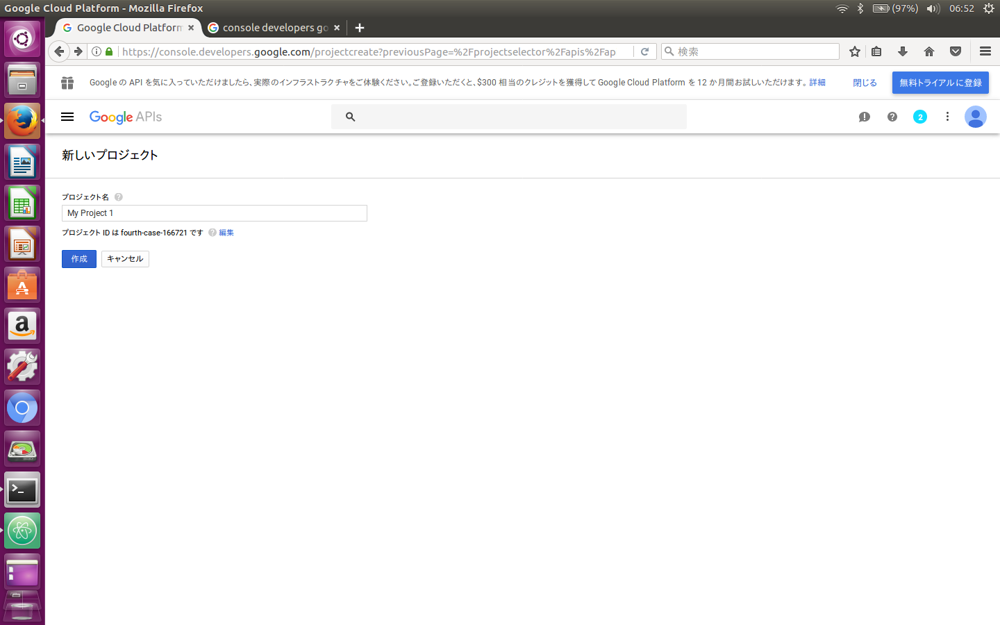
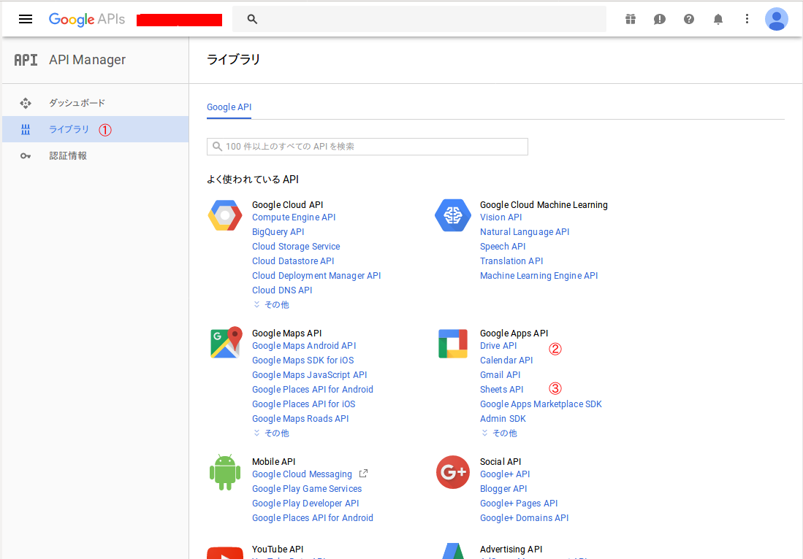

# About easy-google-drive
This repository is ruby library to use google drive of file managmenemt and asscess to spread sheet.
This libary use google DriveV3 and Sheet API V4.
The library saves "gdrive.dat" in root folder of google drive.

## how to use
1. install google drive api for ruby.
```bash
$ sudo gem install google_drive
```
2.  install easy-google-drive

3. setting of google drive
  1. access to [https://console.developers.google.com/](https://console.developers.google.com/)

  2. login google account
  3. click to "プロジェクトを選択"
  4. click "+" button and create new project
  5. click "API Manager" and "Library". Then choose Drive API and Sheet API
  
  6. Enable "Drive API" and "Sheet API"
  7. Click "認証情報" and click "認証情報を作成", Then Choose "OAuth Client ID"
  8. click "同意画面を設定". Input "service name".
  9. choose "その他" and click "作成"
  10. click download button. And change file name to "client_secret.json"
  11. move the file to project folder.

4. execute sample program
```bash
$ ruby test_drive.rb
```
  1. execute test_drive.rb
  2. Copy URL for authorization on display. And paste browser. And click twice.
  3. Display "token" on browser. And copy "token", then paste it on console.
Then display URL for authorization. The URL is copied and paste to URL in browser.Then please copy token code in browser and paste on console display.

## APIs
### Drive APIs
```ruby
require 'easy-google-drive'
myDrive = EasyGoogleDrive::Drive.new
```

#### cd (change directory)
   command                |  operation
--------------------------|-------------------------
 myDrive.cd("directory")  |  change directory
 myDrive.cd("$")          |  move to shared folder
 myDrive.cd("~")          |  move to root foloder of my drive
 myDrive.cd("~/directory")|  move to directory on root foloder of my drive

#### mkdir (make directory)
command                     |  operation
----------------------------|-------------------------
myDrive.mkdir("directory")  |  make directory named "directory"

#### rm (remove file)
command                         |  operation
--------------------------------|-------------------------
myDrive.rm("file")              |  delete file
myDrive.rm("~/directory/file")  |  delete file

#### get (get file from google drive)
command                         |  operation
--------------------------------|-------------------------
myDrive.get("src","dst")        |  get "src" in google drive. "dst" is destination file name.

#### send (send file to google driver)
command                         |  operation
--------------------------------|-------------------------
myDrive.send("src","dst")        |  send "src" in local drive and put "dst" in google drive.

### Spreadsheet APIs
```ruby
require 'easy-google-drive'
mySheet = EasyGoogleDrive::Spreadsheet.new
```
#### open (open file)
command                         |  operation
--------------------------------|-------------------------
mySheet.open("file")            |  open "file".

#### addNewLine(sheet,data) (add data at the bottom line in sheet)
command                           |  operation
----------------------------------|-------------------------
mySheet.addNewLine("sheet",data)  |  Add new line. <br>"sheet":    sheet name <br>data: Array data.
(example)<br>
- mySheet.addNewLine("",[10,100,1000]) :<br>
  add [10,100,1000] to new line in default sheet.<br>
- mySheet.addNewLine("Sheet2",[10,100,1000]) :<br>
  add [10,100,1000] to new line in "sheet2"

#### getData(sheet,range) (open file)
  command                           |  operation
  ----------------------------------|-------------------------
  mySheet.getData("sheet","range")  |  get data in "range" from "sheet"
  - mySheet.getData("","A:E") :<br>
    get all data of "A:E" from default sheet
  - mySheet.getData("Sheet2","A2:E5") :<br>
    get data in "A2:E5" from "Sheet2"


## Tips
The authorization data is stored in "~/.credentials/"
